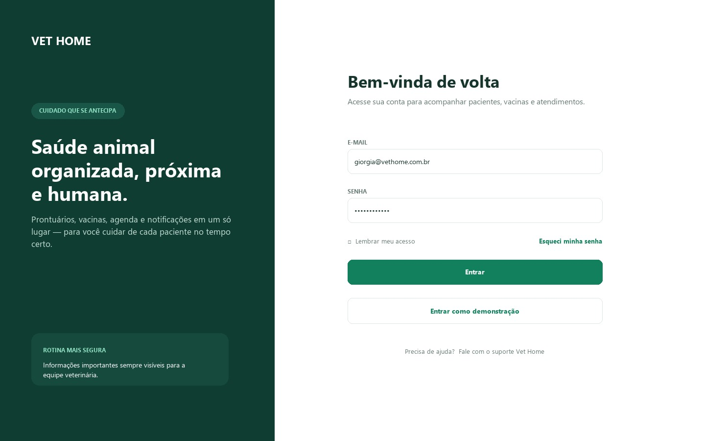
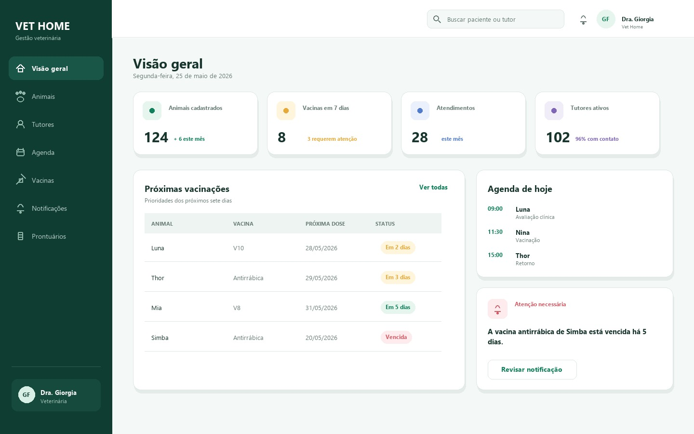
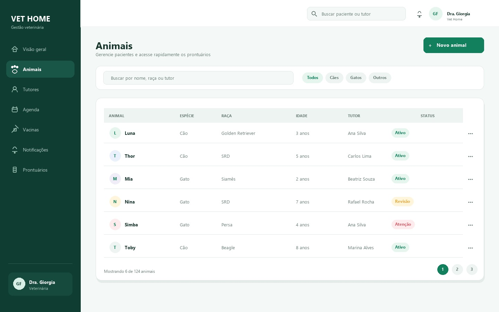
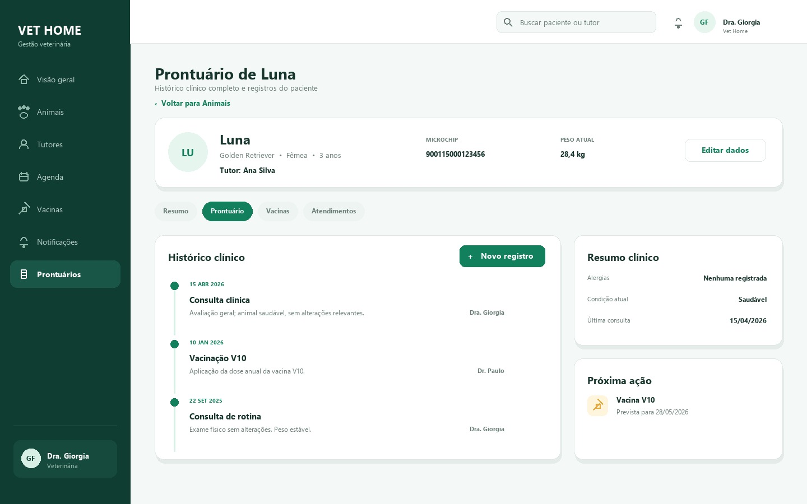
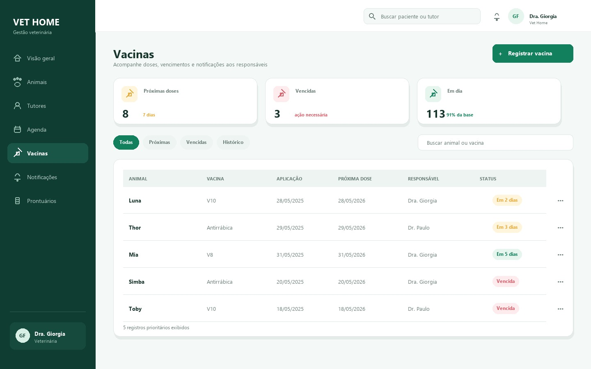
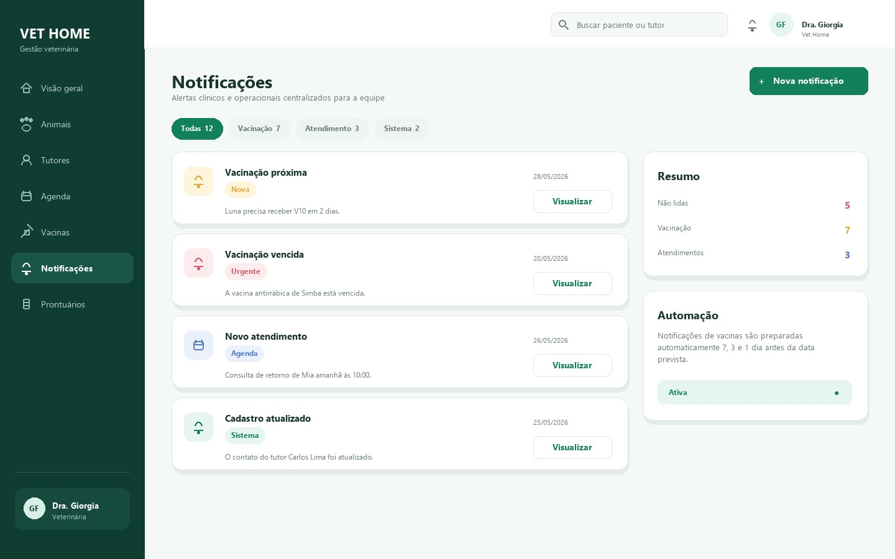
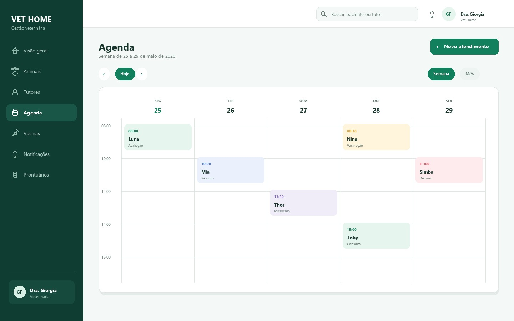
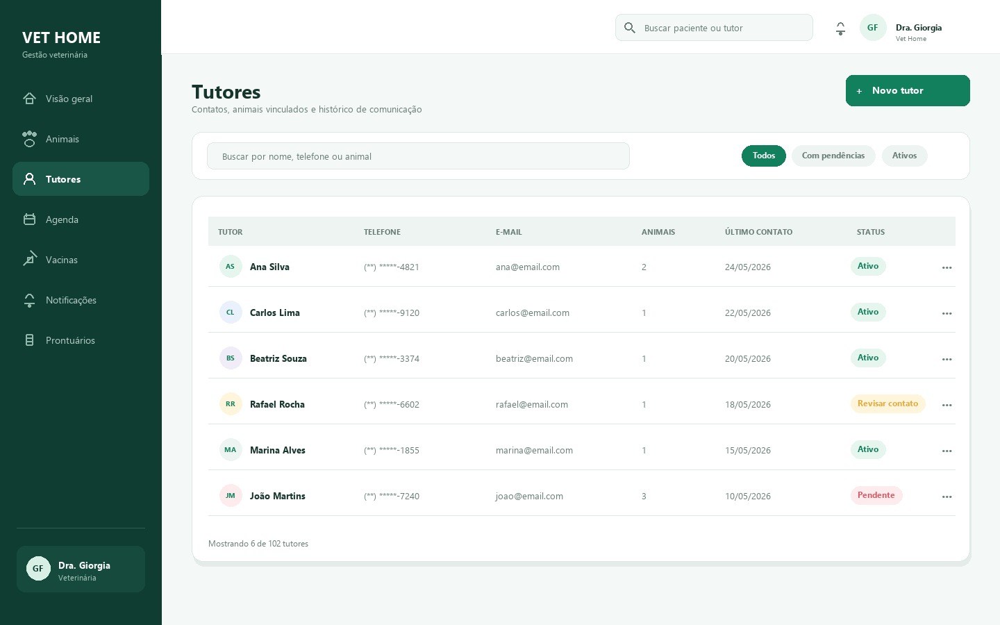
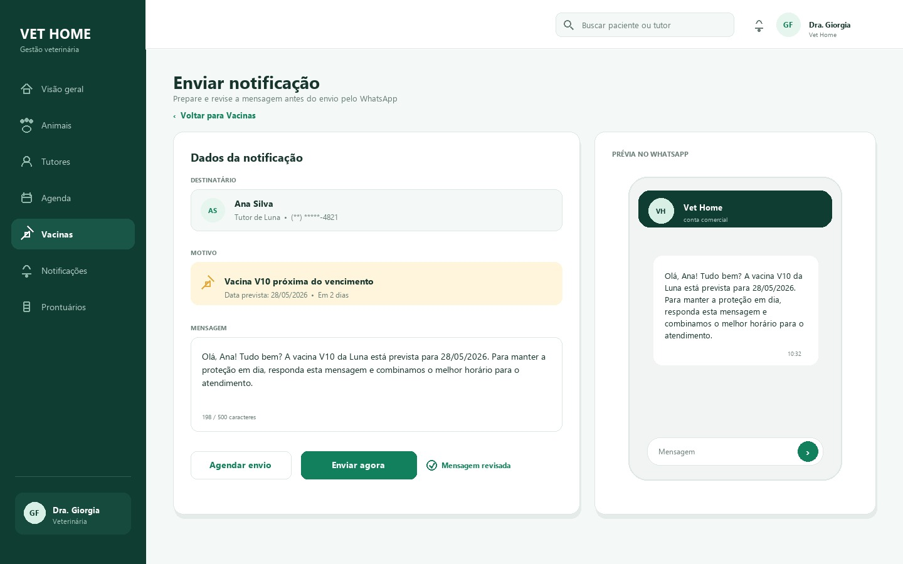

## **1. Tela de Login** 

Descrição: A tela de login permite a identificação do profissional e controlar o acesso ao sistema de forma simples e segura 

### **1.1 Componentes principais** 

- Campos para e-mail e senha, com opção de exibir ou ocultar a senha. 

- Opção para manter o usuário conectado e link para recuperação de acesso. 

- Botão principal para entrar no sistema e acesso demonstrativo (para 

- protótipo). 

## **2. Tela de Visão Geral** 

Descrição: A tela de visão geral apresenta o resumo da rotina veterinária e destaca as informações que exigem atenção imediata do profissional com acesso. 

### **2.1 Componentes principais** 

- Indicadores de animais cadastrados, atendimentos, vacinas e notificações. 

- Tabela de vacinas próximas do vencimento e painel com os compromissos 

- do dia. 

- Alerta prioritário para pendências clínicas ou administrativas. 

- Menu lateral compartilhado com as demais telas do sistema. 

## **3. Tela de Animais** 

Descrição: A tela de animais armazena o cadastro e a consulta dos pacientes atendidos pela equipe veterinária. 

### **3.1 Componentes principais** 

- Campo de pesquisa e filtros por espécie, situação ou outros critérios 

- relevantes. 

- Tabela com nome do animal, espécie, raça, idade, tutor, situação e ações 

- disponíveis. 

- Botão para incluir um novo animal e controles de paginação da lista. 

## **4. Tela de Prontuário** 

Descrição: A tela de prontuário reúne o histórico clínico do animal em uma consulta organizada e de fácil compreensão. 

### **4.1 Componentes principais** 

- Cabeçalho com dados de identificação do animal, tutor, microchip, peso e 

- informações essenciais. 

- Abas para separar histórico, vacinas, exames, prescrições e outros registros. 

- Linha do tempo com consultas e procedimentos realizados. 

- Resumo clínico e destaque para a próxima vacina ou pendência. 

## **5. Tela de Vacinas** 

Descrição: A tela de vacinas controla o calendário vacinal dos animais e reduz atrasos por meio de uma visão consolidada dos prazos. 

### **5.1 Componentes principais** 

- Cartões de resumo para vacinas próximas, vencidas e em dia. 

- Abas e filtros para organizar os registros por situação, período ou animal. 

- Tabela com animal, vacina, última dose, próxima aplicação, situação e ações. 

- Botão para registrar uma nova aplicação. 

## **6. Tela de Notificações** 

Descrição: A tela de notificações concentra alertas do sistema para que a equipe acompanhe prazos, pendências e ocorrências importantes. 

### **6.1 Componentes principais** 

- Filtros por categoria, prioridade, data e estado de leitura. 

- Lista de notificações com título, resumo, data, situação e acesso ao item 

- relacionado. 

- Indicadores de mensagens não lidas e informações sobre alertas 

- automáticos. 

## **7. Tela de Agenda** 

Descrição: A tela de agenda organiza consultas, retornos e visitas veterinárias domiciliares. 

### **7.1 Componentes principais** 

- Calendário semanal com dias, horários e compromissos distribuídos por faixa 

- de tempo. 

- Alternância entre visualização semanal e mensal. 

- Controles para avançar ou retornar no período e botão para criar um 

- agendamento. 

- Identificação visual do tipo e da situação de cada compromisso. 

## **8. Tela de Tutores** 

Descrição: A tela de tutores organiza os dados de contato dos responsáveis e facilita a associação entre tutores e animais. 

### **8.1 Componentes principais** 

- Pesquisa por nome, telefone ou e-mail e filtros por situação do cadastro. 

- Tabela com nome, dados de contato, quantidade de animais vinculados, 

- último contato e situação. 

- Botão para cadastrar um novo tutor e ações por registro. 

## **9. Tela de Envio de notificação via WhatsApp** 

Descrição: A tela de envio de notificação via WhatsApp permite que a equipe revise e envie ao tutor um lembrete de vacina ou outra informação importante 

### **9.1 Componentes principais** 

- Identificação do destinatário e do animal relacionado à mensagem. 

- Motivo do contato, data de vencimento e campo editável para o texto da 

- mensagem. 

- Pré-visualização da conversa para conferência antes do envio. 

- Controles para agendar, enviar ou retornar à tela anterior. 

